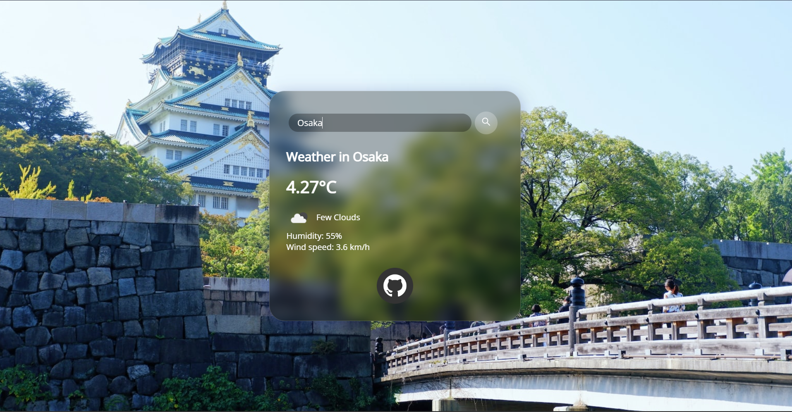

# Weather-Web-App
  
<h2 style="display: inline-block">Table of Contents</h2>

  <ol>
    <li>
      <a href="#about-the-project">About The Project</a>
      <ul>
        <li><a href="#built-with">Built With</a></li>
      </ul>
    </li>
    <li><a href="#license">License</a></li>
  </ol>

## About The Project

 
* An humble, intriguing and responsive Weather web-app built using HTML, CSS and Javascript.  
* * It uses <a href="https://opencagedata.com/api">OpenCageData Geocoder API</a> to fetch exact location coordinates of the user.  
* It uses <a href="https://openweathermap.org/api">OpenWeatherMap API</a> to fetch Temperature, Weather, Humidity & Wind Speed details.  
* Background images are fetched from <a href="https://source.unsplash.com">Unsplash</a> and is changed according to the City name.  
* Built based on the 2021 UI trend 'Glassmorphism' <a href="https://uxdesign.cc/glassmorphism-in-user-interfaces-1f39bb1308c9">(Read More...)</a>.  
* Hosted using <a href="https://captainvc.github.io/Weather-App/">Github Pages</a>.  

### Built With

* HTML & CSS
* Javascript
* Vanilla tilt.js library
* OpenWeatherMap & OpenCageData API
* Unsplash
   
### License

Distributed under the MIT License. See `LICENSE` for more information.
